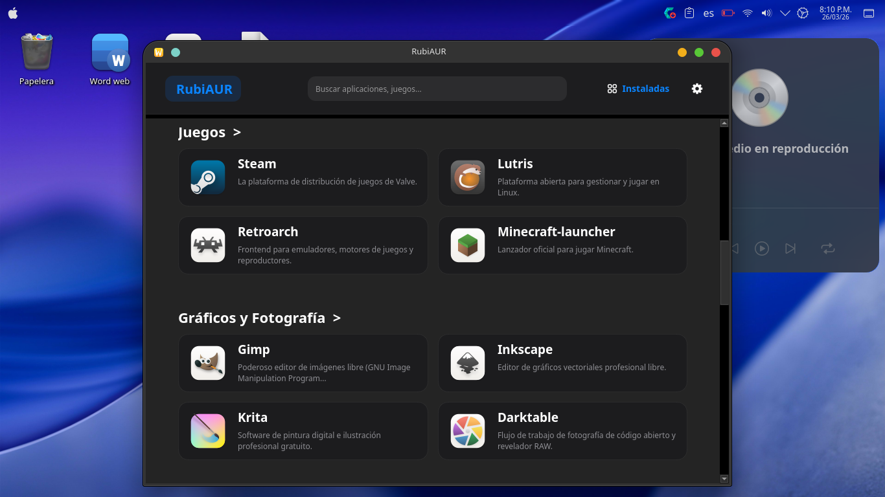

🌍 Read this in: [Español](README.md) | [English](README-en.md)

---

# 💎 RubiAUR

**La forma más elegante de gestionar tu sistema Arch Linux.**

RubiAUR es una tienda de aplicaciones y gestor de paquetes gráfico construido con Python y PySide6. Diseñado meticulosamente para ofrecer una experiencia premium, fluida y visualmente atractiva, unificando el poder de `pacman` y el ecosistema de AUR (`yay` / `paru`) en una sola interfaz moderna.

 

## ✨ Características Principales

* 🚀 **Interfaz Premium y Responsiva:** Diseño líquido que se adapta perfectamente desde pantallas de laptops hasta monitores 4K. Animaciones fluidas, transiciones suaves y cero bloqueos.
* 📦 **Todo el software en un solo lugar:** Explora un catálogo curado por categorías, o utiliza el buscador inteligente con autocompletado en tiempo real para encontrar paquetes oficiales o de la comunidad (AUR).
* 🎨 **Temas Dinámicos:** Soporte nativo para Modo Oscuro, Modo Claro y Automático. Los íconos vectoriales están dibujados matemáticamente, garantizando que nunca se pixelarán.
* ⚙️ **Control Total del Sistema:** * Instala y desinstala aplicaciones con un clic.
  * Busca y aplica actualizaciones de todo el sistema.
  * Herramienta integrada para limpiar la caché y dependencias huérfanas de forma segura.
* 📊 **Información Detallada:** Obtén descripciones, peso estimado de los paquetes, íconos obtenidos dinámicamente y comentarios de la comunidad para los paquetes de AUR.
* 🪄 **Asistente de Bienvenida e Instalador Visual:** Configura tus preferencias (idioma, tema, backend) en el primer inicio. Incluye un instalador gráfico para integrar la aplicación a tu menú del sistema sin tocar la terminal.

## 📥 Instalación (Recomendado)

La forma más sencilla de utilizar RubiAUR es mediante el paquete precompilado que incluye nuestro asistente gráfico de instalación.

1. Ve a la sección de **[Releases](../../releases)** y descarga el archivo comprimido de la última versión.
2. Extrae el contenido en una carpeta.
3. Abre tu terminal en esa carpeta y ejecuta el instalador visual:
   ```bash
   chmod +x installer
   ./installer
4. Si las aplicaciones de aur no se instalan asegúrate de tener instalado yay o paru:
   instala git desde la app RubiAUR
   ```bash
   git clone https://aur.archlinux.org/yay.git
   cd yay
   makepkg -si
