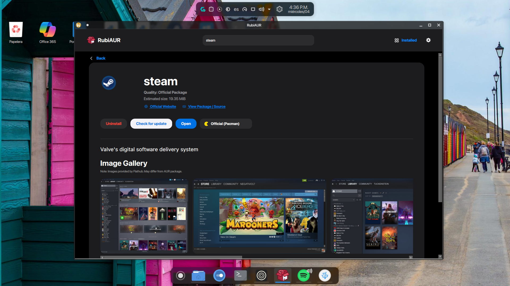

🌍 Read this in: [English](README.md) | [Español](README-es.md) 

---

<p align="center">
  
</p>

# 💎 RubiAUR


**The most elegant way to manage your Arch Linux system.**

RubiAUR is a graphical app store and package manager built with Python and PySide6. Meticulously designed to deliver a premium, fluid, and visually appealing experience, unifying the power of `pacman` and the AUR ecosystem (`yay` / `paru`) into a single modern interface.

 

## ✨ Key Features

* 🚀 **Premium & Responsive UI:** Liquid design that adapts perfectly to everything from laptop screens to 4K monitors. Fluid animations, smooth transitions, and zero freezes.
* 📦 **All your software in one place:** Browse a curated catalog by category, or use the smart real-time auto-completion search to find official packages or community ones (AUR).
* 🖼️ **App Gallery (New in v1.3!):** Visually preview software before installing. RubiAUR dynamically fetches official screenshots and metadata directly from the Flathub/AppStream API.
* 🎨 **Dynamic Themes:** Native support for Dark Mode, Light Mode, and Auto. Vector icons are drawn mathematically, ensuring they never pixelate.
* ⚙️ **Total System Control:** * Install and uninstall applications with one click.
  * Search for and apply system-wide updates.
  * Built-in tool to safely clear cache and remove orphaned dependencies.
* 🪄 **Smart Installer & Setup:** Configure your preferences (language, theme, backend) on first launch. If you don't have an AUR helper installed, RubiAUR will automatically bootstrap and install `yay` for you in the background.



## 📥 Installation (Recommended)

The easiest way to use RubiAUR is through the pre-compiled AppImage package, which includes our graphical installation wizard.

1. Go to the **[Releases](../../releases)** section and download the latest `RubiAUR_Release.zip`.
2. Extract the contents into a folder.
3. Open your terminal in that folder and run the visual installer:
   ```bash
   chmod +x installer
   ./installer

🛠️ Building from source

If you want to run the source code directly or contribute to the project:
Bash

git clone [https://github.com/cesarmoralesb20005-ctrl/RubiAUR](https://github.com/cesarmoralesb20005-ctrl/RubiAUR)
cd RubiAUR
pip install -r requirements.txt
python src/main.py

🌎 Languages

Currently, the RubiAUR store is fully translated and supports:

    🇬🇧 English

    🇪🇸 Spanish

    🇫🇷 French

    🇩🇪 German
